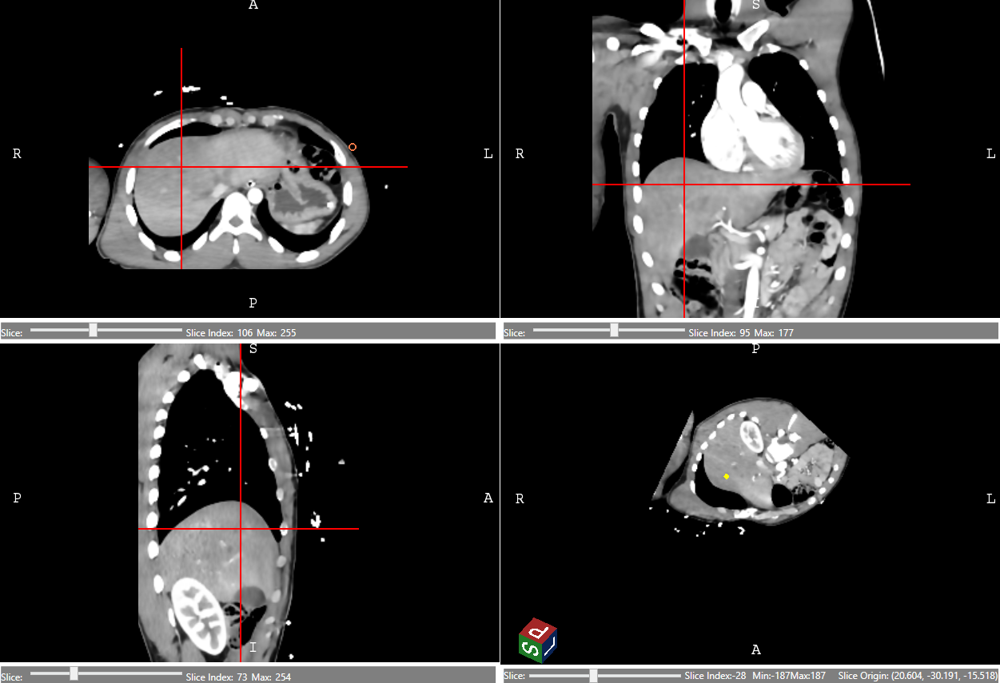

# VtkMvvm

A .NET library that facilitates the implementation of the MVVM (Model-View-ViewModel) pattern when working with
Activiz.NET and VTK .NET wrapper.

## Overview

VtkMvvm is designed to simplify the development of applications using VTK (Visualization Toolkit) through Activiz.NET by
providing a structured MVVM architecture. The library includes pre-defined Controls and ViewModels that help implement
the MVVM pattern effectively.

### Features

- Pre-defined Controls for the View layer
- Pre-defined ViewModels for the ViewModel layer
- MVVM pattern support for VTK visualization
- Integration with Activiz.NET
- Support for .NET 8.0 Windows applications

### Requirements

- .NET 8.0
- Windows OS
- Activiz.NET.x64 package

## Usages

1. Add the package reference to your project:

```xml

<ItemGroup>
    <ProjectReference Include="..\VtkMvvm\VtkMvvm.csproj"/>
    <PackageReference Include="Activiz.NET.x64" Version="5.8.0"/>
</ItemGroup>
```

2. Ensure your project targets .NET 8.0 Windows:

```xml
<TargetFramework>net8.0-windows</TargetFramework>
```

### Project Structure

The library follows the MVVM pattern with the following layers:

- **View Layer**: Contains pre-defined Controls for VTK visualization
- **ViewModel Layer**: Contains pre-defined ViewModels for handling business logic

### Example: Medical Image Visualization with Orthogonal Slices

The following example demonstrates how to create a medical image visualization application with orthogonal slices 
(Axial, Coronal, and Sagittal views) using the MVVM pattern.

  

#### ViewModel Implementation

```csharp
public class VtkMvvmTestWindowViewModel : BindableBase
{
    private readonly vtkImageData _background;
    private readonly vtkImageData _labelMap;
    
    public VtkMvvmTestWindowViewModel()
    {
        // Load and process image data
         _background = TestImageLoader.ReadNifti(@"TestData\CT_Abdo.nii.gz");
        
        // Create image pipeline for background and label map
        var backgroundPipeline = ColoredImagePipelineBuilder
            .WithSharedImage(_background)
            .Build();
            
        _labelMap = CreateLabelMap(_background);
        
        var labelMapPipeline = ColoredImagePipelineBuilder
            .WithSharedImage(_labelMap)
            .WithRgbaLookupTable(_labelMapLut)
            .Build();
        
        // Create ViewModels for each orthogonal slice
        AxialVms = new[] {
            new ImageOrthogonalSliceViewModel(SliceOrientation.Axial, backgroundPipeline),
            new ImageOrthogonalSliceViewModel(SliceOrientation.Axial, labelMapPipeline)
        };
        
        // Similar setup for Coronal and Sagittal views...
    }
    
    public ImageOrthogonalSliceViewModel[] AxialVms { get; }
    public ImageOrthogonalSliceViewModel[] CoronalVms { get; }
    public ImageOrthogonalSliceViewModel[] SagittalVms { get; }
}
```

#### XAML Implementation

```xaml
<Window x:Class="PresentationTest.VtkMvvmTestWindow"
        xmlns="http://schemas.microsoft.com/winfx/2006/xaml/presentation"
        xmlns:x="http://schemas.microsoft.com/winfx/2006/xaml"
        xmlns:controls="clr-namespace:VtkMvvm.Controls;assembly=VtkMvvm">
    
    <Grid>
        <Grid.RowDefinitions>
            <RowDefinition Height="*"/>
            <RowDefinition Height="*"/>
        </Grid.RowDefinitions>
        <Grid.ColumnDefinitions>
            <ColumnDefinition Width="*"/>
            <ColumnDefinition Width="*"/>
        </Grid.ColumnDefinitions>
        
        <controls:VtkOrthoImageSceneControl 
            x:Name="AxialControl"
            Grid.Row="0" Grid.Column="0"
            SceneObjects="{Binding AxialVms}"/>
            
        <controls:VtkOrthoImageSceneControl 
            x:Name="CoronalControl"
            Grid.Row="0" Grid.Column="1"
            SceneObjects="{Binding CoronalVms}"/>
            
        <controls:VtkOrthoImageSceneControl 
            x:Name="SagittalControl"
            Grid.Row="1" Grid.Column="0"
            SceneObjects="{Binding SagittalVms}"/>
    </Grid>
</Window>
```

This example demonstrates:

- Setting up orthogonal slice views for medical image visualization
- Implementing MVVM pattern with pre-defined Controls and ViewModels
- Handling user interaction through custom interactors
- Managing multiple views with synchronized data

## License

This project is licensed under the MIT License - see the [LICENSE](LICENSE) file for details.

```
MIT License

Copyright (c) 2024 VtkMvvm Contributors

Permission is hereby granted, free of charge, to any person obtaining a copy
of this software and associated documentation files (the "Software"), to deal
in the Software without restriction, including without limitation the rights
to use, copy, modify, merge, publish, distribute, sublicense, and/or sell
copies of the Software, and to permit persons to whom the Software is
furnished to do so, subject to the following conditions:

The above copyright notice and this permission notice shall be included in all
copies or substantial portions of the Software.

THE SOFTWARE IS PROVIDED "AS IS", WITHOUT WARRANTY OF ANY KIND, EXPRESS OR
IMPLIED, INCLUDING BUT NOT LIMITED TO THE WARRANTIES OF MERCHANTABILITY,
FITNESS FOR A PARTICULAR PURPOSE AND NONINFRINGEMENT. IN NO EVENT SHALL THE
AUTHORS OR COPYRIGHT HOLDERS BE LIABLE FOR ANY CLAIM, DAMAGES OR OTHER
LIABILITY, WHETHER IN AN ACTION OF CONTRACT, TORT OR OTHERWISE, ARISING FROM,
OUT OF OR IN CONNECTION WITH THE SOFTWARE OR THE USE OR OTHER DEALINGS IN THE
SOFTWARE.
```
